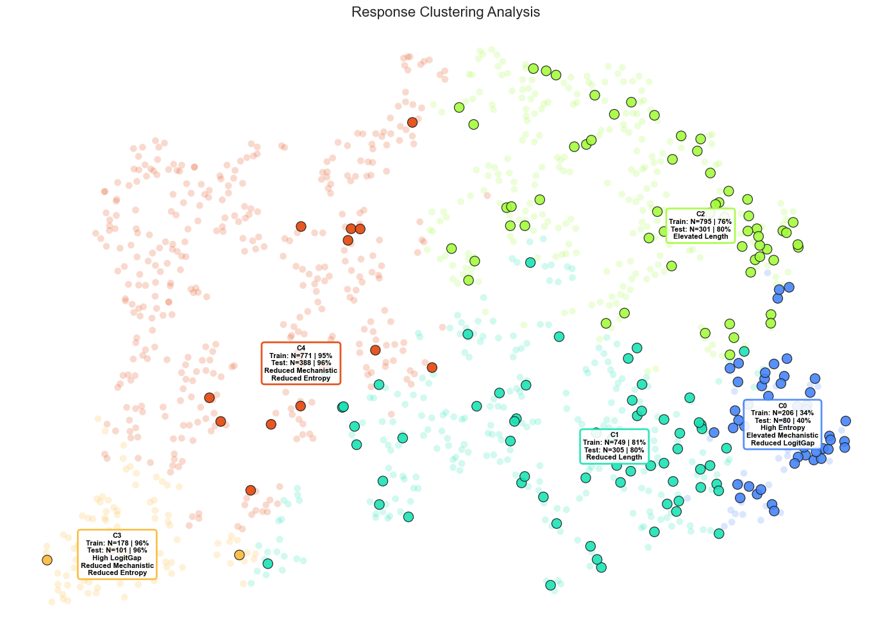

# Uncertainty-Aware-Error-Detection-and-Recovery 


## Team Information
- **Team Name**: Uncertainty Quantification
- **Members**: Troy Daniels, Sadi Gulcelik, Shayan Chowdhury

---

## 1. Problem Statement
 LLMs lack calibrated confidence, leading to unflagged hallucinations in reasoning tasks. Existing methods (like self-consistency or raw entropy) often capture only single dimensions of uncertainty. We investigate how to estimate confidence using only the model's own generations and explore which signals best predict failure in reasoning tasks.

---

## 2. Approach & Models

**Models**: `Qwen2.5-1.5B-Instruct` (Generation), `Qwen2.5-3B-Instruct` (Initial Grading) `Mistral-7b-Instruct` (Regrading), `Llama 8B` Mechanistic Analysis
**Dataset**: GSM8K

We employ a **multi-signal pipeline** to capture complementary uncertainty metrics across three categories:

**A. One-Shot Metrics (Single Generation)**

* **Token Entropy**: Average entropy of next-token predictions; high entropy implies low confidence.
* **Min Logit Gap**: Over a sequence, the minimum difference in log-probability between the top-1 and top-2 tokens.
* **Mechanistic Uncertainty**: Activation variance from specific "entropy neurons" in the final MLP layer.
* **Heuristic Confidence**: Semantic distance between the generation and fixed "certainty" vs. "uncertainty" anchor embeddings (e.g., "I am sure" vs. "maybe").
* **Length**: Length of the response in tokens (added later as a baseline)

**B. Multi-Sample Metrics (Ensemble)**

* **Semantic Entropy**: Entropy over the probability of answer groups.
* **Consistency**: Roughly speaking, the cosine similarity between the embeddings of different traces.

## 3. Key Results
Our analysis of the GSM8K benchmark yielded the following insights:

* **Metric Efficacy**: Semantic Entropy is the strongest single predictor of correctness.
* **Ensembling**: The ensemble of single-shot metrics did exhibit strong performance (~0.82 % AUROC).
* **Clustering** Unsupervised clustering of the metrics yields an effective clustering of the test set by both difficulty and correctness. 




*(See `analysis_notebook.ipynb` and presentation slides for detailed AUROC plots and cluster visualizations.)*


---

## 4. Reproducibility Instructions

### A. Setup
```bash
pip install torch transformers sentence-transformers pandas numpy scikit-learn tqdm matplotlib

```

### B. Execution Order

The pipeline is modular. Steps 2–4 are optional refinements to improve label accuracy and metric richness.

**Step 1: Main Experiment (Required)**
Generates traces, computes metrics, and saves to SQLite.

```bash
python run_experiment.py

```

**Step 2: Refine Correctness (Optional)**
Uses a stronger local LLM to re-grade answers for higher fidelity labels.

```bash
python fix_correctness.py

```

**Step 3: Regenerate Semantic Entropy (Optional)**
Re-runs clustering if definitions or embeddings are updated with the above step.

```bash
jupyter notebook fix_semantic.ipynb

```

**Step 4: Add Consistency Metrics (Optional)**
Computes consistency across traces.

```bash
jupyter notebook consistency_dwt_simple.ipynb

```

**Step 5: Analysis & Visualization**
Generates visualizations and analysis, including the final dashboard, AUROC curves, and failure mode clusters.

```bash
jupyter notebook analysis_notebook.ipynb

```

---

## 5. Notes


### **Core Pipeline** (ensemble-data-collection)

* `run_experiment.py`: **Main Entry Point**. Orchestrates the entire pipeline: samples questions, runs generation, computes one-shot metrics, and saves results.
* `uq_core.py`: **Metric Logic**. Contains the implementation for Token Entropy, Logit Gaps, Mechanistic Uncertainty (entropy neurons), Heuristic Confidence, Semantic Entropy.
* `agent.py`: **Inference Wrapper**. Handles HuggingFace model interaction and captures internal activations for mechanistic analysis.
* `db_manager.py`: **Persistence**. Manages the SQLite database.

### **Analysis & Refinement** (ensemble-data-collection)

* `analysis_notebook.ipynb`: **Primary Dashboard**. Generates AUROC curves, failure mode clusters, and all other final results
* `analysis_utils.py`: **Analysis Helpers**. Contains reusable functions for most of the notebook analysis.
* `fix_correctness.py`: **Regrader**. Uses a stronger local LLM to verify "Gold vs. Prediction" correctness labels in the database.
* `consistency_dwt_simple.ipynb`: **Consistency Module**. Calculates the similarity vectors between reasoning traces.
* `fix_semantic.ipynb`: **Semantic Refinement**. Utility to regenerate semantic entropy scores if definitions change.

### **Mechanistic Interpretability** (`mechanistic_interpretability_code`)

* `Notebooks/entropy_neurons.ipynb`: **Entropy-Neuron Search**. Exploratory notebook that surfaces high-variance neurons, plots scatter views (`entropy_neuron_scatter.png`), and exports candidate IDs for downstream metrics.
* `activations.json`: **Activation Snapshots**. Sample activations for 20 tracked neurons across representative prompts, used to sanity-check neuron behavior.
* `data.json`, `data_qwen.json`, `cosine_var_entropy_neurons.json`: **Neuron ID Lists**. Final entropy-neuron indices for GSM8K (Llama) and Qwen experiments plus cosine-variance candidates.
* `aime_results.csv`: **AIME Token Activations**. 15k+ token-level rows with per-neuron activations and correctness labels for the AIME benchmark.
* `classifer_experiment_raw_data.csv`, `classifer_experiment_logger.txt`: **Classifier Benchmarks**. Accuracy/CI table and detailed logs for activation-based threshold/logit experiments.
* `threshold_experiment_results/`: **Threshold Sweeps**. Per-neuron PNGs and logs showing correctness vs. activation thresholds.
* `plots/`: **Visualization Gallery**. Activation trajectories, max/min/mean distributions, calibration curves, and Qwen-specific plots (`qwen/`, `max_activation/`, `min_activation/`, `max_activation_calibration/`, etc.).
* `output/ScalingFactorVsNormilizationFactor.png`: **Scaling Sweep Plot**. Visualizes calibration scaling vs. normalization factors.
* `Logit_Attribution.pdf`: **Logit Attribution Report**. Slide deck summarizing neuron-level logit lens findings.
* `requirements.txt`: **Env Spec**. Python dependencies for reproducing mechanistic notebooks and plots.
